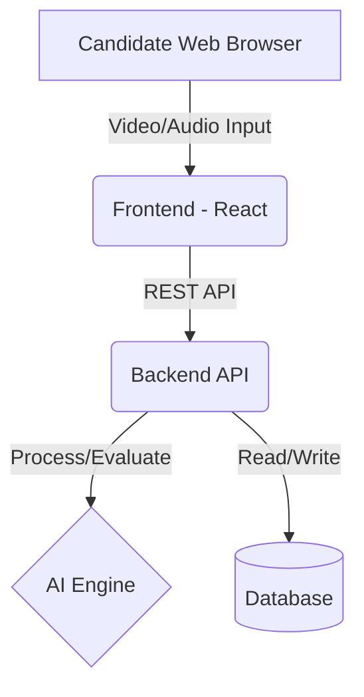

# 🎯 AI Interview Platform

A full-stack, AI-powered mock interview platform designed to help candidates practice and refine their interview skills.

## 🏗 Architecture
The system consists of two main components:
- **Frontend (React)**: Handles candidate video/audio input, real-time question display, and user authentication.
- **Backend (Node.js / Python)**: Processes the responses, queries the AI models for evaluation, and stores candidate feedback in the database.

## 🚀 Features
- **Real-time Evaluation**: Get instant feedback on your answers.
- **Customizable Question Banks**: Tailored to different tech stacks.
- **User Authentication**: Secure login and progress tracking.

## 🛠 Local Setup
1. Clone the repository.
2. Setup the backend: `npm install` (or `pip install -r requirements.txt`).
3. Setup the frontend: `cd frontend && npm install`.
4. Configure your `.env` file.
5. Run both servers to start practicing!
